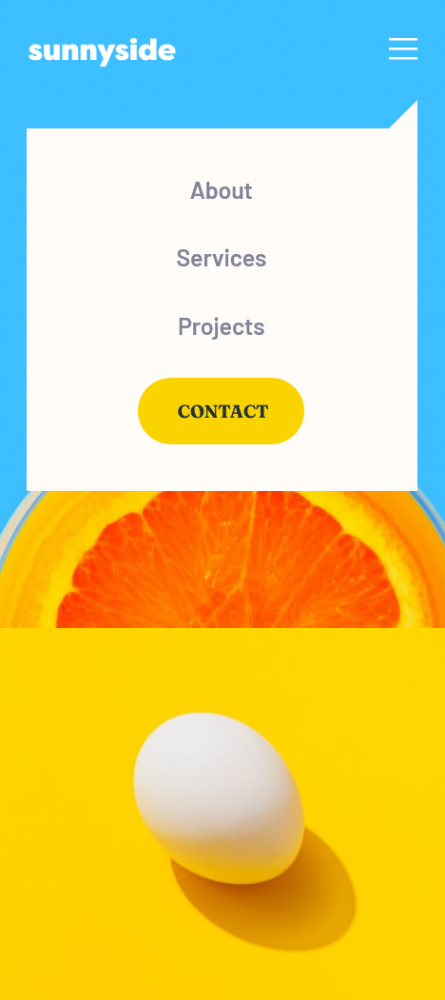

# Sunnyside agency landing page 

## Table of contents

- [Frontend Mentor - Sunnyside agency landing page solution](#frontend-mentor---sunnyside-agency-landing-page-solution)
  - [Table of contents](#table-of-contents)
  - [Overview](#overview)
    - [The challenge](#the-challenge)
    - [Screenshot](#screenshot)
    - [Links](#links)
  - [My process](#my-process)
    - [Built with](#built-with)
    - [What I learned](#what-i-learned)
    - [Continued development](#continued-development)
    - [Useful resources](#useful-resources)
  - [Author](#author)

## Overview

### The challenge

Users should be able to:

- View the optimal layout for the site depending on their device's screen size
- See hover states for all interactive elements on the page

### Screenshot




### Links

- Live Site URL: [Synnyside agency landing page](https://royer-adames-sunnyside-agency-landing-page.vercel.app/)

## My process

### Built with

- Semantic HTML5 markup
- CSS custom properties
- Flexbox
- CSS Grid
- Mobile-first workflow
- TypeScript
- [React](https://reactjs.org/) - JS library
- [Sass](sass-lang.com/) - For styles


### What I learned

Import SVG through React
```js
import { ReactComponent as LogoSvg } from "./images/logo.svg";
};
```
```html
<LogoSvg className="footer__logo" />
```
```css
&__logo{
        fill: var(--desaturated-cyan-700);
        justify-self: center;
    }
```

### Continued development

- Adding links to social media
- Adding menu pages

### Useful resources

- [React srcSet for responsive images](https://crystallize.com/blog/react-srcset-for-responsive-images) - Reminder on how to do responsive images with React.
- [HTMLImageElement.srcset](https://developer.mozilla.org/en-US/docs/Web/API/HTMLImageElement/srcset) - An explanation on how the srcSet works.

## Author

- LinkedIn - [royeradames](https://www.linkedin.com/in/royer-adames/)

